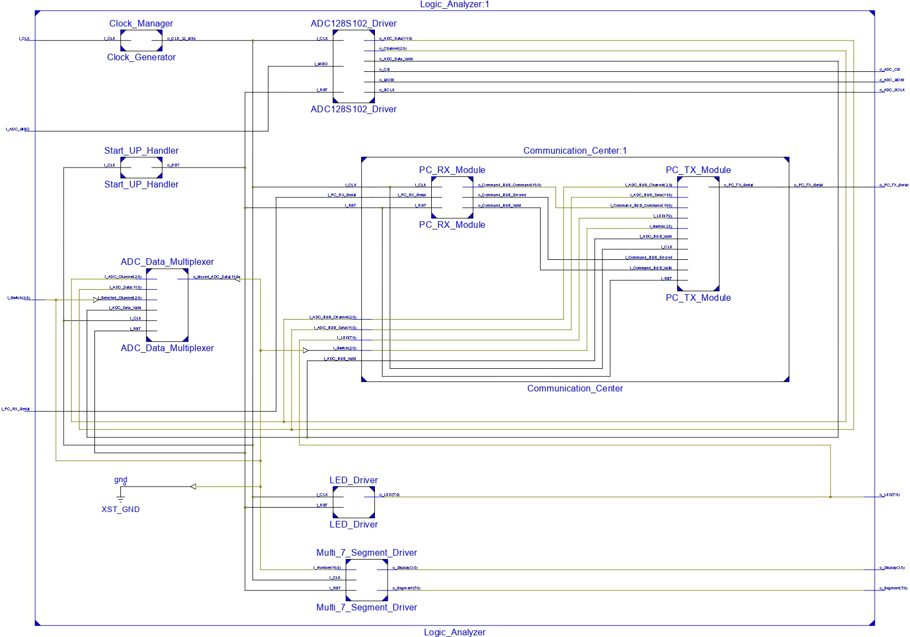

# FPGA-based Logic Analyzer
In this project, a logic analyzer is implemented on a Xilinx Spartan-6 XC6SLX9 using VHDL language. The module can read analog data from 8 different channels and show them on a 7-Segment. The measured data are also sent through the UART communication protocol to be used in other devices. As Spartan-6 does not provide analog inputs, an ADC128S102 converts analog measured data to digital for further processing by the FPGA.
The RTL schematic of the module is shown in the figure below.

The utilizatiion summary when the code is synthesized on a Xilinx XC6SLX9 FPGA is shown in this table:

| |Used|Available|Utilization|
|--|--|--|--|
Number of Slice Registers|522|11,440|4%|
Number of Slice LUTs|763|5,720|13%|
Number of occupied Slices|267|1,430|18%|
Number of bonded IOBs|30|102|29%

- [ ] Develop a MATLAB program to read serial data with 115200 bits/s baud-rate and plot them.